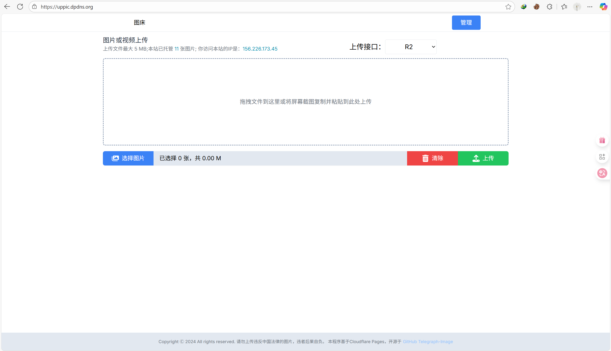
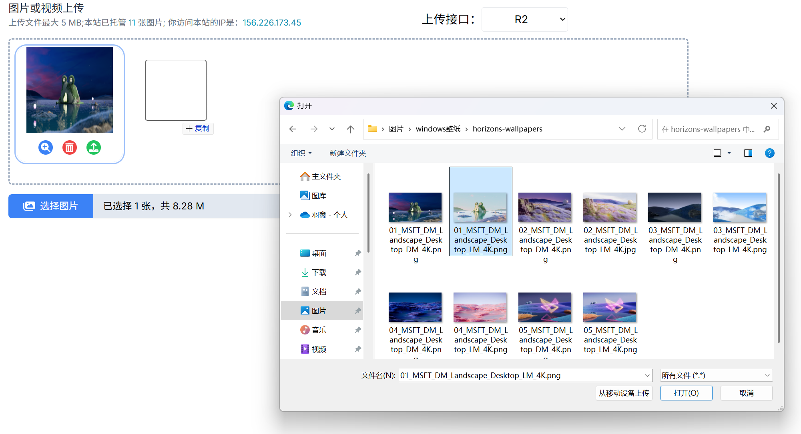
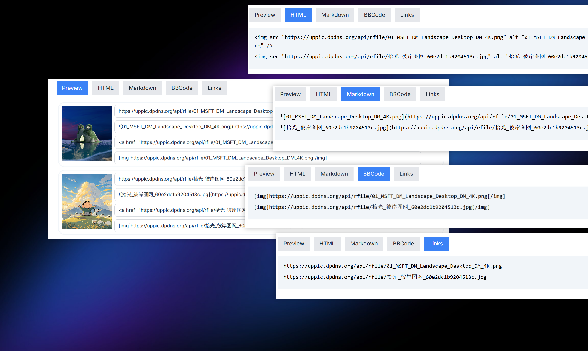
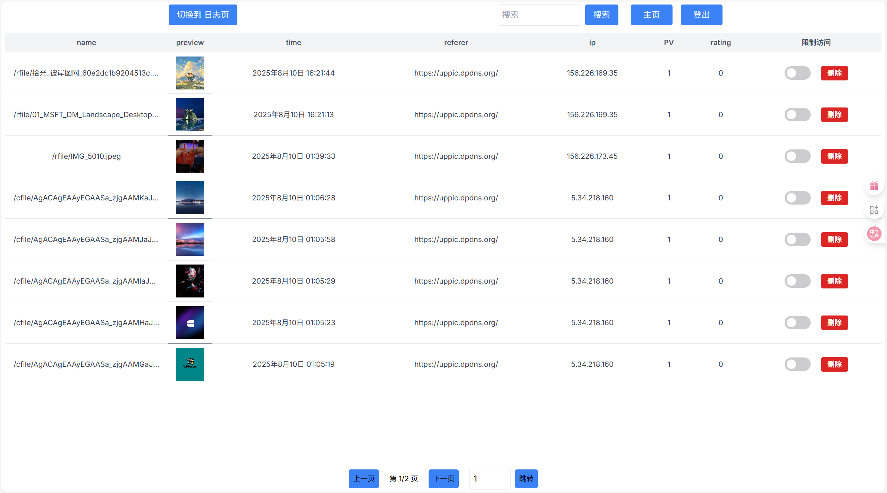
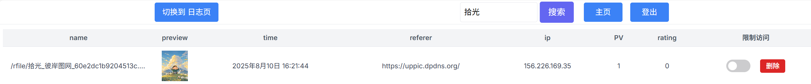
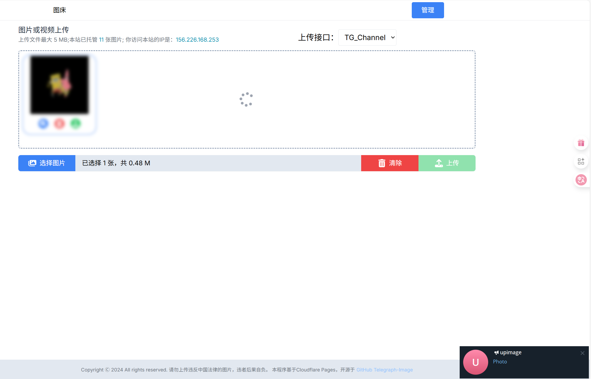
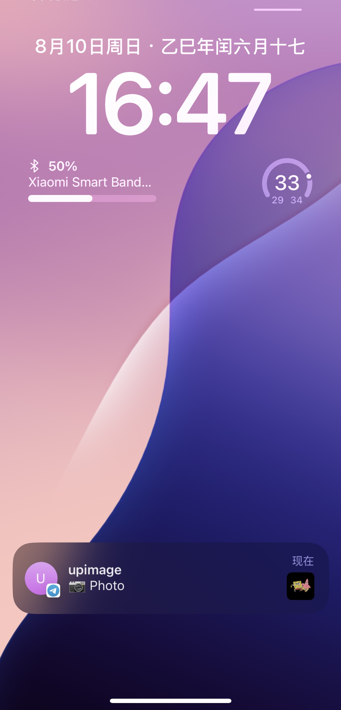
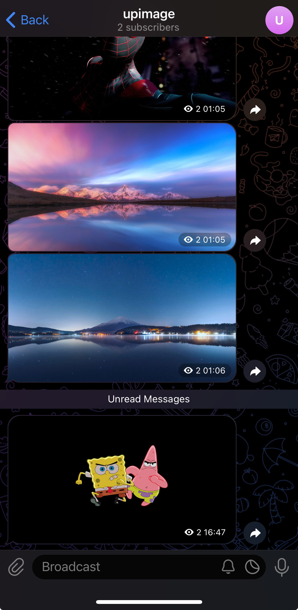
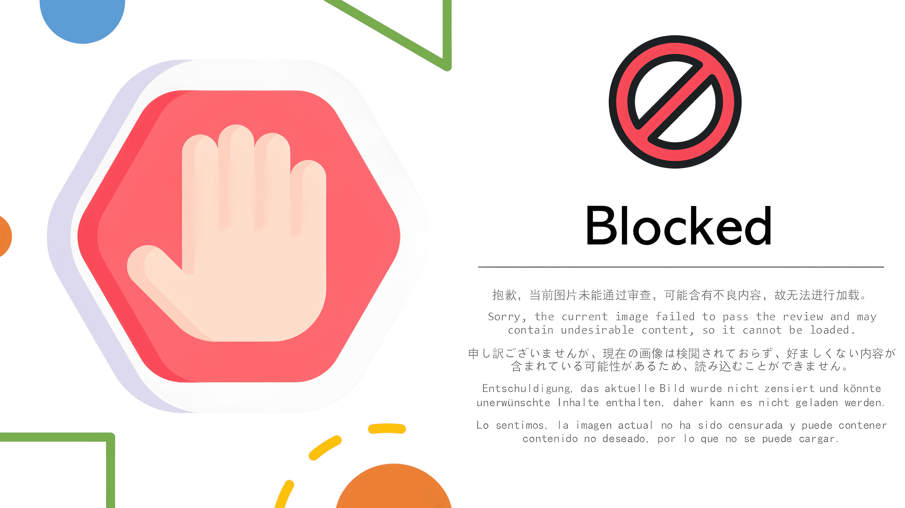

#  CF-Telegrapm-DigitalPlat 图床系统

<div align="center">
    
    
    
    
    
    
</div>


## 项目结构

```
zyx-telegraph-Image/
├── api/                     # API接口核心逻辑
├── components/              # 前端组件
├── pages/                   # 页面路由
│   ├── admin/               # 管理后台
│   └── api/                 # API路由入口
├── public/                  # 静态资源
├── utils/                   # 工具函数
├── .env.example             # 环境变量示例
├── next.config.js           # Next.js配置
├── package.json             # 项目依赖
└── README.md                # 项目文档
```


## 🌐 在线演示

<div align="center">

| 站点类型       | 访问地址                                      |
|----------------|---------------------------------------------|
| **主演示站点** | [https://uppic.dpdns.org/](https://uppic.dpdns.org/) |
| **测试站点**   | [https://zyx-telegraph-image.pages.dev/](https://zyx-telegraph-image.pages.dev/) |

</div>

## 🔐 测试账号

| 账号类型       | 用户名 | 密码   | 权限范围               |
|----------------|--------|--------|------------------------|
| **管理员账号** | ****  | ****  | 完整权限（上传/删除/审核） |
| **普通账号**   | pp     | pp     | 仅图片上传权限          |


  

## 核心功能

### 1. 图片上传
- 支持拖拽/粘贴上传
- 批量上传多张图片
- 自动生成缩略图预览
  

### 2. 多种引用
- Preview
- HTML​
- ​​Markdown​
- BBCode​
- ​Links
  


### 3. 管理后台（admin）
- 实时查看上传记录
- 支持内容审查日志
- 黑白ip管理功能
  
<small>⚠️ 安全提示：建议首次登录后立即修改默认密码</small>
- 后台图片搜索功能
  
- 多平台通知
  
| PC端截图 | iOS端截图 |
| :------: | :------: |
|  | ++  |


### 4. 安全防护
- 双重身份验证（管理员/普通用户）
- 自动内容审查系统
- Referer/IP访问控制
  

## 技术栈

- **前端框架**: Next.js 13+ (App Router)
- **存储服务**: Cloudflare R2
- **内容分发**: Cloudflare CDN
- **安全防护**: ModerateContent API
- **部署平台**: Cloudflare Pages

## 设计特点

1. **极简交互** - 三步完成图片上传分享
2. **隐私保护** - 不上传用户数据到第三方
3. **自适应布局** - 完美适配移动设备
4. **多账号体系** - 区分管理员与普通用户
5. **实时监控** - 可视化数据统计面板

## 快速部署

1. Fork原始仓库：
   ```bash
   git clone https://github.com/x-dr/telegraph-Image.git
   ```

2. 配置Cloudflare Pages：
   - 连接GitHub仓库
   - 选择Next.js框架预设
   - 设置环境变量


## 特别致谢

- [x-dr](https://github.com/x-dr) 提供原始项目
- [Cloudflare](https://www.cloudflare.com/) 提供免费服务
- [Telegraph](https://telegra.ph/) 图片代理服务
- [ModerateContent](https://www.moderatecontent.com/) 内容审查API

## 其他
- 欢迎关注我的个人主页 [dinosaurerer](https://github.com/dinosaurerer?tab=repositories)

- 其他优秀的开源CF项目[Awesome Cloudflare](https://github.com/zhuima/awesome-cloudflare)
## 许可证

本项目采用 [MIT License](LICENSE)

---


